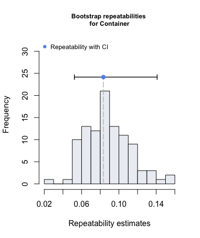
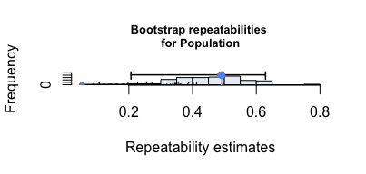

<!-- README.md is generated from README.Rmd. Please edit that file -->

# rptR


[](https://cran.r-project.org/package=rptR)
[](https://CRAN.R-project.org/package=rptR)
[](https://codecov.io/gh/mastoffel/rptR?branch=master)

### Goal

The goal of `rptR` is to provide point estimates, confidence intervals
and significance tests for the **repeatability** (intra-class
correlation coefficient) of measurements based on generalised linear
mixed models (GLMMs). The function `?summary.rpt` produces summaries in
a detailed format, whereby `?plot.rpt` plots the distributions of
bootstrap or permutation test estimates.

### Citation

When using `rptR`, please cite our
[paper](https://besjournals.onlinelibrary.wiley.com/doi/10.1111/2041-210X.12797):

Stoffel, M. A., Nakagawa, S., & Schielzeth, H. (2017). rptR:
Repeatability estimation and variance decomposition by generalized
linear mixed-effects models. *Methods in Ecology and Evolution*,
**8(11)**, 1639-1644.
[](https://doi.org/https://doi.org/10.1111/2041-210X.12797)

### Installation

You can install the stable version of \`rptR\`\` from CRAN with:

``` r
install.packages("rptR")
```

Or the development version from GitHub with:

``` r
# install.packages("remotes")
remotes::install_github("mastoffel/rptR", build_vignettes = TRUE, dependencies = TRUE) 
# manual
browseVignettes("rptR")
```

### Example

Calculating the repeatability of beetle body length (`BodyL`) for both
`Container` and `Population` while adjusting for `Treatment` and `Sex`:

``` r
library(rptR)
data(BeetlesBody)

rpts <- rpt(BodyL ~ Treatment + Sex + (1 | Container) + (1 | Population), 
            grname = c("Container", "Population"), data = BeetlesBody, 
            datatype = "Gaussian", nboot = 100, npermut = 100)
```

An extended summary of the results is shown with `summary()`.

``` r
summary(rpts)
#> 
#> Repeatability estimation using the lmm method
#> 
#> Call = rpt(formula = BodyL ~ Treatment + Sex + (1 | Container) + (1 | Population), grname = c("Container", "Population"), data = BeetlesBody, datatype = "Gaussian", nboot = 100, npermut = 100)
#> 
#> Data: 960 observations
#> ----------------------------------------
#> 
#> Container (120 groups)
#> 
#> Repeatability estimation overview: 
#>       R     SE   2.5%  97.5% P_permut  LRT_P
#>  0.0834 0.0268 0.0462  0.142     0.01      0
#> 
#> Bootstrapping and Permutation test: 
#>             N   Mean   Median   2.5%  97.5%
#> boot      100 0.0888 8.89e-02 0.0462 0.1419
#> permut    100 0.0043 1.09e-11 0.0000 0.0188
#> 
#> Likelihood ratio test: 
#> logLik full model = -1528.553
#> logLik red. model = -1555.264
#> D  = 53.4, df = 1, P = 1.34e-13
#> 
#> ----------------------------------------
#> 
#> 
#> Population (12 groups)
#> 
#> Repeatability estimation overview: 
#>       R     SE   2.5%  97.5% P_permut  LRT_P
#>   0.491  0.111   0.26  0.645     0.03      0
#> 
#> Bootstrapping and Permutation test: 
#>             N   Mean Median   2.5%  97.5%
#> boot      100  0.461  0.464  0.260  0.645
#> permut    100  0.455  0.455  0.424  0.489
#> 
#> Likelihood ratio test: 
#> logLik full model = -1528.553
#> logLik red. model = -1595.399
#> D  = 134, df = 1, P = 3.19e-31
#> 
#> ----------------------------------------
```

#### Plotting

`rptR` estimates uncertainties around repeatability estimates with
parametric bootstrapping. The distribution of bootstrap estimates can
easily be plotted.

``` r
plot(rpts, grname="Container", type="boot", cex.main=0.8, col = "#ECEFF4")
plot(rpts, grname="Population", type="boot", cex.main=0.8, col = "#ECEFF4")
```


