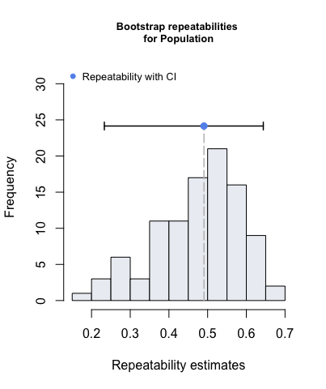

<!-- README.md is generated from README.Rmd. Please edit that file -->

# rptR


[](https://cran.r-project.org/package=rptR)
[](https://codecov.io/gh/mastoffel/rptR?branch=master)

-   get the latest development version from github with

### Goal

The goal of `rptR` is to provide point estimates, confidence intervals
and significance tests of the **repeatability** (intra-class correlation
coefficient) of measurements based on generalised linear mixed models
(GLMMs). The function `?summary.rpt` produces summaries in a detailed
format, whereby `?plot.rpt` plots the distributions of bootstrap or
permutation test estimates.

### Citation

When using \`rptR\`\`, please cite our
[paper](https://besjournals.onlinelibrary.wiley.com/doi/10.1111/2041-210X.12797):

Stoffel, M. A., Nakagawa, S., & Schielzeth, H. (2017). rptR:
Repeatability estimation and variance decomposition by generalized
linear mixed-effects models. Methods in Ecology and Evolution, 8(11),
1639-1644.

[](https://doi.org/https://doi.org/10.1111/2041-210X.12797)

### Installation

You can install the stable version of \`rptR\`\` from CRAN with:

``` r
install.packages("rptR")
```

Or the development version from GitHub with:

``` r
# install.packages("remotes")
remotes::install_github("mastoffel/rptR", build_vignettes = TRUE, dependencies = TRUE) 
# check vignette
browseVignettes("rptR")
```

### Example

``` r
library(rptR)
data(BeetlesBody)

rpts <- rpt(BodyL ~ Treatment + Sex + (1 | Container) + (1 | Population), 
            grname = c("Container", "Population"), data = BeetlesBody, 
            datatype = "Gaussian", nboot = 100, npermut = 100)
#> Bootstrap Progress:
#> Permutation Progress for Container :
#> Permutation Progress for Population :

rpts
#> 
#> 
#> Repeatability estimation using the lmm method 
#> 
#> Repeatability for Container
#> R  = 0.083
#> SE = 0.028
#> CI = [0.048, 0.144]
#> P  = 1.34e-13 [LRT]
#>      0.01 [Permutation]
#> 
#> Repeatability for Population
#> R  = 0.491
#> SE = 0.11
#> CI = [0.247, 0.645]
#> P  = 3.19e-31 [LRT]
#>      0.02 [Permutation]
```

#### Plotting

``` r
plot(rpts, grname="Container", type="boot", cex.main=0.8)
plot(rpts, grname="Population", type="boot", cex.main=0.8)
```


